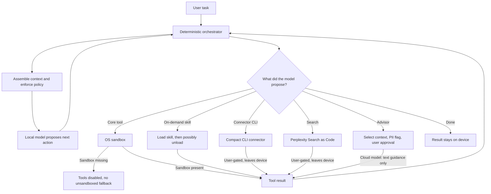

# Architecture, as they describe it

This note records the Portable Computer *loop as written* in Perplexity's 25 Aug 2026 research post, then checks that description against the product page, NVIDIA's launch post, and the Nate Kupp briefing. It does not treat those pages as a source dump of the binary.

A different June 2026 post described a hybrid router for Personal Computer. That is a related product story, not the same mechanism. See [June versus August](#june-versus-august).

## The claimed loop

Company, 25 Aug 2026 research post ([A Local-First Agent for Private and Cost-Effective Knowledge Work](https://www.perplexity.ai/hub/blog/a-local-first-agent-for-private-and-cost-effective-knowledge-work), fetched 26 Aug 2026):

> The entire stack runs locally by default. The model, harness, conversation, and trajectory all live on the user's machine. Work that needs the outside world, such as web search, connectors, or escalation to a stronger advisor model on the cloud, is invoked only when necessary and always gated by the user.

The same post splits roles:

- The **orchestrator** is "deterministic harness code, not an LLM: it maintains the loop, assembles context, and enforces policy."
- The **local model** "proposes the next action."
- The orchestrator "executes approved tool calls in the sandbox and returns their results to the model."
- "Web search, connectors, and advisor calls cross the device boundary only when enabled and approved."

The New Stack (independent report of the same briefing, 25 Aug 2026) restates that split in the same order: local model proposes, orchestrator assembles context, enforces policy, and runs approved tool calls in an OS-level sandbox.

That diagram is a reading of the research post. It is not an independent measurement of the shipping app. Boxes Perplexity did not name (for example "planner" as a separate process from the orchestrator) are omitted here even though the product page lists extra nouns. See [extra nouns on the product page](#extra-nouns-on-the-product-page).

## Orchestrator

Company, research post: deterministic code, not another model. It owns the loop, context assembly, and policy. The local model does not execute tools itself.

Briefing, Nate Kupp to The New Stack, 25 Aug 2026: the team "revisit[ed] almost everything throughout the stack" for smaller local models, reused many Computer capabilities, and changed the harness and model configuration. Kupp said the harness accounted for most of the engineering work.

Briefing, Kupp to VentureBeat, 25 Aug 2026: "The majority of the effort here has been at the agent harness level." Underneath, "the system uses vLLM to host model inference," with "an advanced mode for users who want to plug in their own inference endpoint."

The research post does not mention vLLM or a BYO inference control. Those are briefing claims. Whether the shipping UI exposes that advanced mode is [unanswered](open-questions.md).

## Local model

Company, research post and Portable Computer launch post (25 Aug 2026):

| Model | What they say it is | Status at launch |
| --- | --- | --- |
| Qwen 3.8 27B | Open model. Advertised 260K context. They say it starts to struggle past 100K. | In the picker |
| PPLX 27B | Their post-train of Qwen 3.8 27B, trained inside the Computer harness | In the picker |
| NVIDIA Nemotron 3.5 Lightning | Open 30B class model (research post: "30B total parameters") | "Coming soon" |

NVIDIA's 25 Aug 2026 local-AI blog (company-adjacent) says Portable Computer ships "a specially post-trained Qwen 3.8 27B model" and that Perplexity is "working on a fine-tuned Nemotron 3.5 Lightning variant." That is slightly stronger than "Nemotron in the picker." It claims a Perplexity fine-tune of Nemotron, not only stock Nemotron. The research post does not describe a finished Nemotron post-train.

Kupp, VentureBeat: they have "heavily post-trained both the Qwen and Nemotron models." Same briefing-level claim.

How they say they trained PPLX 27B (company, research post):

1. Use Computer usage data to identify knowledge-work use cases.
2. Synthesize RL environments as Docker containers with an instruction, environment, and verifier. They say the tasks contain no real user documents.
3. Stage 1: rejection fine-tuning. Roll out, keep the best trajectories by verifier score, supervised-train on them.
4. Stage 2: reinforcement learning.
5. Hold out 53 tasks as the Local Knowledge Work Bench.

They promise a technical report on training "soon," and they "plan to open-source this evaluation benchmark." They do not say they will open-source the harness, the post-train mix, or PPLX 27B weights. Weight release is [unanswered](open-questions.md).

## Context, skills, connectors

Company, research post. Compact local models "trail larger frontier models," so they designed the harness around the model's "capability profile" rather than dropping a small model into a frontier-sized harness.

Concrete choices they name:

- **Short core prompt.** "A minimal system prompt and a small set of core tools." They do not list those tools.
- **On-demand skills.** Everything else is "modularized into on-demand skills that load and unload throughout the trajectory." Named skill areas: research, data science, data visualization, document creation, software engineering, "and more."
- **Context compaction.** "Summarizing stale context when a trajectory grows long."
- **Connectors as CLIs, not MCP schemas in context.** "Day-to-day knowledge work often requires connectors such as Gmail, GitHub, Outlook, and Google Calendar." Those are "usually exposed to a harness as MCP servers, whose large tool definitions consume a substantial share of the context." They "converted the most-used MCPs into compact, easy-to-use command-line tools, supplemented with custom skills."

The 100K figure is empirical and company-only. Qwen's advertised 260K window is not in dispute; the claim is that this 27B starts to fail as an agent past 100K.

The connector *names* are not stable across pages:

| Source | Connectors named |
| --- | --- |
| Research post | Gmail, GitHub, Outlook, Google Calendar |
| Product page (search-index excerpt, 26 Aug 2026) | Gmail, Outlook, Slack, GitHub; also Perplexity Search, wide or deep research |
| VentureBeat briefing | Google Drive, Gmail, GitHub; Slack used in a demo |
| NVIDIA local-AI blog | Google Drive, Gmail, Slack, GitHub |

Treat "the connector list" as marketing-complete, not as an inventory of the binary. Whether those CLIs are local wrappers around Perplexity-hosted OAuth, or local protocol clients, is [unanswered](open-questions.md). Web search and connector calls "leave the device" (The New Stack, restating the company). Inference and private-document processing are said to stay local.

## Sandbox

Company, research post:

> The harness executes tools in an OS-level sandbox on the user's device. The boundary restricts processes, filesystem paths, and network access according to policy. This limits the blast radius of an erroneous command. If the sandbox is unavailable, the harness disables itself before any tool calls rather than degrading to unsandboxed execution.

They contrast this with Pi and Hermes, "which run commands directly with the user's permissions by default." In Computer, "isolation is always on, requires no configuration, and tools cannot run without it."

Independent check on the comparison targets, 26 Aug 2026:

- **Pi** ([earendil-works/pi](https://github.com/earendil-works/pi) README): "Pi does not include a built-in permission system for restricting filesystem, process, network, or credential access. By default, it runs with the permissions of the user and process that launched it." That matches Perplexity's contrast for Pi. Pi documents optional containerization (Gondolin micro-VM, Docker, OpenShell) as something the user adds.
- **Hermes** ([NousResearch/hermes-agent](https://github.com/NousResearch/hermes-agent) README): ships multiple terminal backends, including local, Docker, SSH, Singularity, Modal, Daytona, and Vercel Sandbox. "Isolated sandboxing" is a featured capability, not a hidden extra. Perplexity's "by default" claim may still be true for the local backend. The README does not say the local backend is always sandboxed. Treat the Hermes half of the contrast as company-asserted, only partly checked.

What the sandbox *is* (seccomp, Landlock, user namespace, Firecracker, a Docker runtime, a Perplexity daemon) is not stated. Do not invent it.

## Self-verification

Company, research post. Performance "improves when the agent verifies its own work." Verification "can be triggered by the model itself or by a set of hooks that monitor the health of the trajectory and request self-verification when something goes wrong."

No public list of those hooks.

## Cloud advisor

Company, research post. Hard tasks still exceed the compact model. The harness exposes an **advisor** tool. The local model decides when to ask. The orchestrator "retains tool authority and controls what context is sent."

Escalation is optional. "The user decides whether to enable it and whether to approve each advisor call manually or automatically."

Before a call, the harness:

1. selects relevant context
2. applies a "PII classifier to flag sensitive information"
3. shows the user what would leave the device

The advisor "receives only the approved context and returns text guidance; it has no direct access to the device's files, tools, or conversations."

Terminal Bench 2.1 numbers they report (company, same post; all points on the Computer harness):

| Setup | Score | Estimated API cost per rollout |
| --- | --- | --- |
| Qwen 3.8 27B fully local | 59.6% | ~0 |
| Qwen 3.8 27B + Claude Opus 5 advisor | 73.0% | $0.415 |
| Claude Opus 5 alone in the local harness | 82.4% | $0.65 |

They say they did not add an advisor tool to Pi or Hermes because that would change those harnesses.

**Conflict on the approval UX.** The research post allows "manually or automatically" approving each advisor call. Computerworld (25 Aug 2026) quotes Perplexity communications manager Beejoli Shah in an emailed statement:

- "content in a local document can't authorize an escalation by itself, nor can it override product controls"
- escalation "requires explicit per-action approval in addition to toggling the app out of default local-only mode"
- the setting is named "allow advisor escalation"; if it is off, "no work can proceed to the cloud"
- "Escalation is only allowed once, not across the remainder of the task, or in future sessions"

Shah is more restrictive than the research post (one escalation per task, always explicit, named toggle). Both are company. The research post is the technical writeup. Shah is launch-week comms answering enterprise-exfiltration questions. Which one the app implements is [unanswered](open-questions.md).

Product-page language (search-index excerpt of [Portable Computer: Local-First AI](https://www.perplexity.ai/hub/products/portable-computer), 26 Aug 2026) says the orchestrator can route a step to "one of 15+ cloud models." The research post's measured advisor is Claude Opus 5. "15+" is a cloud Computer roster, not a list of local weights.

That same product-page excerpt says the local orchestrator can escalate for "current information, browser use, connected apps, or one of 15+ frontier models." "Browser use" as a cloud escalation reason sits next to Kupp's "we're not doing computer use at this point." Those can both be true if "computer use" means driving the *user's* GUI and "browser use" means a cloud browser. They can also contradict. See [open-questions.md](open-questions.md).

## Search

Company, research post: the local harness is built "alongside Perplexity's search engine" and "accesses it through the Search as Code interface." Local files are "the authoritative source." Users "can disable web search entirely for fully offline work."

Search as Code is a separate 1 Jun 2026 Perplexity research article, [Rethinking Search as Code Generation](https://research.perplexity.ai/articles/rethinking-search-as-code-generation) (published header also shows 18 Aug 2026 UTC). It describes exposing search primitives to agents as generated Python in a sandbox, rather than as a single MCP/tool call. It is the architecture they say Computer uses for heavy retrieval. Whether Portable Computer on a Spark runs that same Agentic Search SDK locally, or calls Perplexity's hosted search, is not specified beyond "accesses it through the Search as Code interface" and the product-page claim that Portable Computer "can also call Perplexity Search." Calling Perplexity Search leaves the device.

BrowseComp (1,266 tasks, company, research post), all with on-device Qwen 3.8 27B on a DGX Spark, medium reasoning:

| Harness | Accuracy | Mean wall time | Mean tokens |
| --- | --- | --- | --- |
| Computer (Perplexity search) | 66.7% | 402.1 s | 852k |
| Pi (Brave, "their recommended search provider") | 50.2% | 826.0 s | 2.82M |
| Hermes (Brave) | 43.9% | 1,020.9 s | 1.01M |

Incomplete outcomes scored zero. Time and token averages excluded rollouts without recorded measurements. This comparison is harness *plus* search backend. It is not a pure harness bake-off.

## Documents

Company, research post. The harness "passes document pages and images directly to the model." Processing "on device keeps sensitive documents and their extracted content private."

ParseBench-100 (100 tasks, 20 each of charts, layout, tables, text content, formatting), same Qwen 3.8 27B / DGX Spark setup:

| Harness | Mean | Chart | Layout | Table | Text | Formatting | Time | Tokens |
| --- | --- | --- | --- | --- | --- | --- | --- | --- |
| Computer | 65.1% | 76.5% | 16.2% | 72.7% | 87.9% | 72.4% | 60.6 s | 20.1k |
| Hermes | 34.6% | 29.3% | 2.9% | 44.1% | 61.5% | 35.2% | 108.3 s | 32.1k |
| Pi | 13.9% | 2.5% | 0.1% | 11.0% | 29.7% | 26.1% | 410.5 s | 829.1k |

Layout is weak for all three. These are company numbers.

## Extra nouns on the product page

The Portable Computer product page (search-index excerpt, 26 Aug 2026) and Computerworld's quotation of the announcement add components the research post does not define as separate processes:

> The orchestrator, planner, tool router, scheduler, durable task queue, and local search index all run on device.

Possible readings:

1. Marketing names for pieces of the same deterministic harness.
2. Additional on-device services the research post compressed into "orchestrator."

There is no public diagram that maps those six words onto processes, files, or ports. This notebook does not invent that map. "Local search index" is particularly underspecified: index of what, built how, stored where.

NVIDIA's post adds "24×7 always-on operation" on DGX Spark. That is a hardware pitch. It does not say Portable Computer is the same always-on Mac-mini daemon as Personal Computer.

## June versus August

Company, 3 Jun 2026 range, [The Data Center Moves to Your Machine](https://www.perplexity.ai/hub/blog/the-data-center-moves-to-your-machine) (Cloudflare-blocked here; quotes from search index and from THE DECODER, 3 Jun 2026):

- "the first hybrid local-server inference orchestrator"
- it "reasons about what work should run on your device and what work should go to agents in the cloud, and it routes each part of a task to the right place automatically"
- "Unlike tools that ask you to pick local or cloud up front, this happens on its own, task by task"
- announced with Intel, also said to run on NVIDIA RTX Spark
- Personal Computer with local inference "coming in July"

The 25 Aug research post opens by pointing at that June orchestrator, then describes Portable Computer. The August mechanism is *not* automatic routing by a compact classifier:

- August: every task starts local; the orchestrator is deterministic code; the local model proposes actions including an advisor *tool*; the user gates off-device calls.
- June: a compact local model decides local vs cloud "on its own."

Those can be successive products, a quiet design change, or two layers (a router plus a tool loop) described sloppily. Public text does not resolve it. Do not collapse them into one architecture.

## What this note refuses to infer

Not in public text, so not claimed here:

- language or framework of the orchestrator
- sandbox implementation
- whether skills are files, prompts, or packages
- whether connector CLIs talk to Perplexity's cloud or to the vendor API directly
- whether the local search index is embeddings, inverted index, or something else
- whether Portable Computer shares code with cloud Computer
- any ABI, port, or package contents of `apt-get install perplexity`
